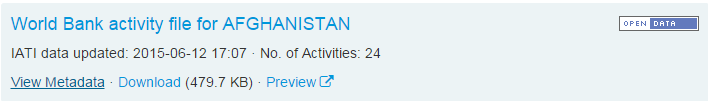
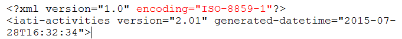

# PMT Database IATI Compatibility
Comprehensive documentation of how the PMT database is compatible with the 
[**IATI (_International Aid Transparency Initiative_) Standards**](http://iatistandard.org/). 

### What are the IATI Standards?
The IATI Standard provides a model for publishing aid information, enabling diverse and
dispersed information to be compared for the benefit of the international community. 

### How is the PMT Database compatible with the IATI Standards? 
- The data model (the tables and their relationships) was built using the IATI Standard as 
a guide.
- The PMT uses a taxonomy data model to classify data records or fields. Any IATI Codelist
can be loaded into the PMT as a taxonomy using an import function.
- We have an import function to load a IATI formatted activities document into the PMT 
Database. Currently supporting IATI Activities schema version [2.01](http://iatistandard.org/201/activity-standard/) 
& [1.04](http://iatistandard.org/104/activity-standard/).

### PMT Database Benefits
- Ability to compare any datasets within the IATI Registry that have a location or any 
other aid dataset that has the basic data elements (activity title, location) that can 
be manually loaded into the PMT Database.
- Ability to spatially visualize data within the PMT Database through the PMT Viewer, a
web application specifically developed in tandem with the PMT Database to offer visualization,
summarization and other data discovery tools allowing the international community to 
explore and compare.
- A wealth of database functions supporting a wide variety of data functionality. Functions
support both common functions, such as CRUD, and application specific logic.
- The PMT Database is well documented and continually being improved upon through its
increased usage.

## Documentation Specifics

[Core IATI Codelists](#core-iati-codelists)

[How to Load IATI Activities](#how-to-load-iati-activities)

[IATI to PMT Field Mapping](#iati-to-pmt-field-mapping)

* * * * *

## Core IATI Codelists

#### Description

The PMT Database depends on a select number of IATI Codelists to be loaded in order to support
core PMT Database logic. Any number of the IATI Codelists can be loaded into the PMT, however
the following codelists **must** be loaded into the PMT Database **before any activity data**. 

#### Codelists

- [Activity Scope](http://iatistandard.org/201/codelists/ActivityScope/)

- [Activity Status](http://iatistandard.org/201/codelists/ActivityStatus/)

- [Country](http://iatistandard.org/201/codelists/Country/)

- [Currency](http://iatistandard.org/201/codelists/Currency/)

- [DAC 3 Digit Sector (Sector Category)](http://iatistandard.org/201/codelists/SectorCategory/)

- [DAC 5 Digit Sector](http://iatistandard.org/201/codelists/Sector/)

- [Finance Type (category)](http://iatistandard.org/201/codelists/FinanceType-category/)

- [Finance Type](http://iatistandard.org/201/codelists/FinanceType/)

- [Gazetteer Agency](http://iatistandard.org/201/codelists/GazetteerAgency/)

- [Geographic Exactness](http://iatistandard.org/201/codelists/GeographicExactness/)

- [Geographic Location Class](http://iatistandard.org/201/codelists/GeographicLocationClass/)

- [Geographic Location Reach](http://iatistandard.org/201/codelists/GeographicLocationReach/)

- [Geographic Vocabulary](http://iatistandard.org/201/codelists/GeographicVocabulary/)

- [Geographical Precision](http://iatistandard.org/201/codelists/GeographicalPrecision/)

- [Gazetteer Agency](http://iatistandard.org/201/codelists/GazetteerAgency/)

- [Language](http://iatistandard.org/201/codelists/Language/)

- [Location Type (category)](http://iatistandard.org/201/codelists/LocationType-category/)

- [Location Type](http://iatistandard.org/201/codelists/LocationType/)

- [Organisation Role](http://iatistandard.org/201/codelists/OrganisationRole/)

- [Organisation Type](http://iatistandard.org/201/codelists/OrganisationType/)

- [Result Type](http://iatistandard.org/201/codelists/ResultType/)

- [Sector Vocabulary](http://iatistandard.org/201/codelists/SectorVocabulary/)

- [Transaction Type](http://iatistandard.org/201/codelists/TransactionType/)

[&larrhk; Back to Documentation Specifics](#documentation-specifics)

* * * * *

## How to Load IATI Activities 

The [IATI Data Registry](http://iatiregistry.org/) has a vast number of organizations publishing 
their data in the registry using the [IATI Activities Standard](http://iatistandard.org/201/activity-standard/).
Any dataset using the IATI Activities schema version [2.01](http://iatistandard.org/201/activity-standard/) 
& [1.04](http://iatistandard.org/104/activity-standard/) in this registry can be loaded into the PMT, by following 
the below instructions:

1. Download a published activity dataset from the registry.

2. Open the downloaded xml file in a text viewer program (i.e. WordPad, NotePad, TextEdit) and retreive the 
document encoding type from the xml tag's encoding attribute:

3. Match the encoding to one the listed Postgres encodings below:
  - SQL_ASCII
  - BIG5
  - EUC_CN
  - EUC_JP
  - EUC_KR
  - EUC_TW
  - GB18030
  - GBK
  - LATIN6
  - LATIN7
  - LATIN8
  - LATIN9
  - LATIN10
  - LATIN1
  - LATIN2
  - LATIN3
  - LATIN4
  - ISO_8859_5
  - ISO_8859_6
  - ISO_8859_7
  - ISO_8859_8
  - LATIN5
  - JOHAB
  - KOI8R
  - KOI8U
  - MULE_INTERNAL
  - SJIS
  - WIN1258
  - UHC
  - UTF8
  - WIN1250
  - WIN1251
  - WIN1252
  - WIN1256
  - WIN866
  - WIN874
  - EUC_JIS_2004
  - SHIFT_JIS_2004

4. Open and follow the instructions outlined in [PMT IATI Activities](https://github.com/spatialdev/PMT-Database/blob/master/Documentation/Installation/PMTIATIActivities.sql) 
in the /Documentation/Installation folder of the repo.

[&larrhk; Back to Documentation Specifics](#documentation-specifics)

* * * * *

## IATI to PMT Field Mapping

#### Description

The pmt\_iati\_import function loads a IATI Activity formatted XML document into the PMT database.
The following table documents the mapping of data from the XML document elements and attributes
into the PMT table fields. Only the listed IATI Activity schema elements listed are loaded into
the PMT Database. Each development cycle of the database adds more elements and enriches the functionality
of the system. The below documentation reflects version [2.01](http://iatistandard.org/201/activity-standard/) 
of the Activity Standard.

|XML Element		|XML Attribute		|PMT Table		|PMT Field		|Taxonomy		|Description		|
|-----------------------|-----------------------|-----------------------|-----------------------|-----------------------|-----------------------|
|iati-identifier	|text()			|activity		|\_iati\_identifier	|			|The unique identifier for the activity. This is the source's identifier, not the PMT primary key.|
|title/narrative	|xml:lang		|activity		|\_title			|Language		|The language of the activity title. |
|title/narrative	|text()			|activity		|\_title			|			|The activity title. |
|description/narrative	|xml:lang		|activity		|\_description, \_objective, \_content|Language	|The language of the activity field. |
|description/narrative	|text()			|activity		|\_description, \_objective, \_content|		|The activity description, objective or content. |
|description 		|type			| 			|			|			|The type determines the placement of the text into the activity table. 1: \_description, 2: \_objective, 3/other: \_content |
|activity-date		|type			|			|			|			|The type determines the placement of the date into the activity table: 1: \_plan\_start\_date, 2: \_start\_date, 3: \_plan\_end\_date, 4/other: \_end\_date |
|activity-date  	|iso-date		|activity		|\_plan\_start\_date, \_start\_date, \_plan\_end\_date, \_end\_date|		|The activity description, objective or content. |
|activity-scope		|code			|activity		|			|Activity Scope		|The Activity Scope taxonomy classification is assigned to the activity record according to the IATI code. |
|activity-status	|code			|activity		|			|Activity Status	|The Activity Status taxonomy classification is assigned to the activity record according to the IATI code. |
|sector			|vocabulary		|activity		|			|			|Determines which Sector taxonomy to use when assigning the sector@code: 1: Sector, 2: Sector Category |
|sector			|code			|activity		|			|Sector OR Sector Category	|The Sector OR Sector Category taxonomy classification is assigned to the activity record according to the IATI code. |
|participating-org/narrative|xml:lang		|organization		|\_name			|Language		|The language of the organization field. |
|participating-org/narrative|text()		|organization		|\_name			|			|The organization's name. |
|participating-org	|type			|organization		|			|Organisation Type	|The Organisation Type taxonomy is assigned to the above organisation record according to the iati code. |
|participating-org	|role			|participation		|			|Organisation Role	|A participation record is created between the above organization and the activity and the Organisation Role taxonomy is assigned to the participation record according to the IATI code. |
|contact-info/person-name/narrative|text()	|contact		|\_first\_name		|			|The contact's name. IATI doesn't split up the name into first and last, so all is stored in \_first\_name.|
|contact-info/job-title/narrative|text()	|contact		|\_title			|			|The contact's title.|
|contact-info/telephone/narrative|text()	|contact		|\_direct\_phone		|			|The contact's phone.|
|contact-info/email/narrative|text()		|contact		|\_email			|			|The contact's email.|
|contact-info/website/narrative|text()		|contact		|\_url			|			|The contact's website/url.|
|contact-info/organization/narrative|text()	|contact		|organization\_id	|			|The organization record is created if it does not exist. The organization\_id is added to the contact (foreign key).|
|location/point/pos	|text()			|location		|\_point			|			|The location point is created using the latitude and longitude values. |
|location/location-id	|vocabulary		|location		|			|GeographicVocabulary	|The Geographic Vocabulary taxonomy classification is assigned to the location record according to the IATI code. |
|location/location-id	|code			|location		|\_geographic\_id		|			|The geographic feature id of the boundary specified by the location/location-id@vocabulary code.|
|location/name/narrative|xml:lang		|location		|\_title			|Language		|The language of the location title. |
|location/name/narrative|text()			|location		|\_title			|			|The lcoation title. |
|location/description/narrative	|xml:lang	|location		|\_description		|Language		|The language of the location field. |
|location/description/narrative	|text()		|location		|\_description		|			|The location description. |
|location/administrative|vocabulary		|location		|			|GeographicVocabulary	|The Geographic Vocabulary taxonomy classification is assigned to the location record according to the IATI code. |
|location/administrative|code			|location		|\_geographic\_id		|			|The geographic feature id of the boundary specified by the location/administative@vocabulary code.|
|location/administrative|level			|location		|\_geographic\_level	|			|The geographic level of the boundary specified by the location/administative@vocabulary code.|
|location/location-reach|code			|location		|			|Geographic Location Reach|The Geographic Location Reach taxonomy classification is assigned to the location record according to the IATI code. |
|location/exactness	|code			|location		|			|Geographic Exactness	|The Geographic Exactness taxonomy classification is assigned to the location record according to the IATI code. |
|location/location-class|code			|location		|			|Geographic Location Class|The Geographic Location Class taxonomy classification is assigned to the location record according to the IATI code. |
|location/feature-designation|code		|location		|			|Location Type		|The Location Type taxonomy classification is assigned to the location record according to the IATI code. |
|budget/value		|text()			|financial		|\_amount		|			|The financial amount. |
|budget/value		|currency		|financial		|			|Currency		|If the currency is NOT USD then the Currency taxonomy classification is assigned to the financial record according to the IATI code. PMT assumes all amounts are USD unless otherwise flagged by a taxonomy.|
|budget/period-start	|iso-date		|financial		|\_start\_date		|			|The financial start date. |
|budget/period-end	|iso-date		|financial		|\_end\_date		|			|The financial end date. |
|planned-disbursement/value|text()		|financial		|\_amount		|			|The financial amount. |
|planned-disbursement/value|currency		|financial		|			|Currency		|If the currency is NOT USD then the Currency taxonomy classification is assigned to the financial record according to the IATI code. PMT assumes all amounts are USD unless otherwise flagged by a taxonomy.|
|planned-disbursement/period-start|iso-date	|financial		|\_start\_date		|			|The financial start date. |
|planned-disbursement/period-end|iso-date	|financial		|\_end\_date		|			|The financial end date. |
|transaction/value	|text()			|financial		|\_amount		|			|The financial amount. |
|transaction/value	|currency		|financial		|			|Currency		|If the currency is NOT USD then the Currency taxonomy classification is assigned to the financial record according to the IATI code. PMT assumes all amounts are USD unless otherwise flagged by a taxonomy.|
|transaction/transaction-date|iso-date		|financial		|\_start\_date		|			|The financial start date. |
|transaction/finance-type|code			|financial		|			|Finance Type		|The Finance Type taxonomy classification is assigned to the financial record according to the IATI code.|
|transaction/transaction-type|code		|financial		|			|Transaction Type	|The Transaction Type taxonomy classification is assigned to the financial record according to the IATI code.|
|transaction/sector	|vocabulary		|activity		|			|			|Determines which Sector taxonomy to use when assigning the sector@code: 1: Sector, 2: Sector Category |
|transaction/sector	|code			|activity		|			|Sector OR Sector Category|The Sector OR Sector Category taxonomy classification is assigned to the activity record according to the IATI code. |