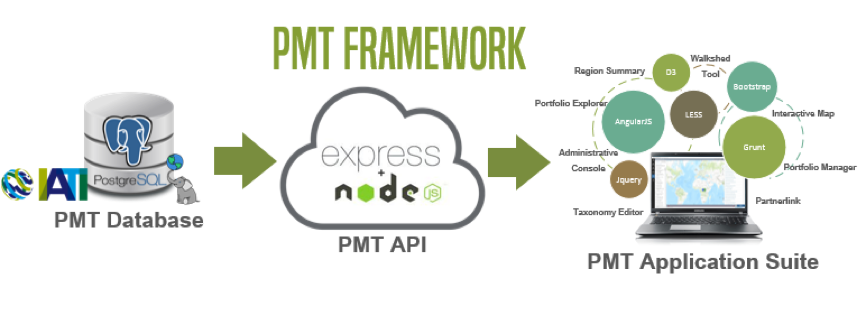

# PMT Framework

The Portfolio Mapping Tool 3.0 (PMT) is a web-based mapping application intended to help visualize where development work is taking place.  The features of this web application allow users to browse, map, add, edit, and share projects without the need for geographic information systems expertise.  It is ultimately intended to help users improve project strategies and partnerships for greater impact in their work. Its features and functions have been designed to provide the following benefits: 

* **Inform strategic and project management decisions.** The PMT can help inform decisions by allowing users to take geographic information into account, whether it is the location of markets, related projects and partners, travel time, annual precipitation, or maize crop yields.
* **Communicate programmatic projects to key stakeholders.** A key benefit to users of the PMT is to see the spatial layout of their projects relative to context. Users can add their projects to the PMT database and then visualize those projects in a variety of ways.
* **Understand how programmatic efforts relate to other projects as well as to useful agricultural information.** Users are able to browse and map other people’s projects alongside their own projects. This functionality provides the framework for multiple organizations to communicate vital strategic information together in a coordinated fashion.

The PMT framework is comprised of three major components: application, API and database. Each of these three components are required and are dependent on one another. Figure 1 depicts a high level visual diagram of the relationship between them.

The PMT database is a PostgreSQL 9.3 RDBMS utilizing the spatial extender PostGIS 2.1 for spatial data storage support. The PMT data model is based on the IATI Standard v 2.01, which provides a technical publishing framework for reporting individual development cooperation activities/projects.  

The PMT application is a highly configurable suite of features and modules that allow users to explore, analyze, query and manage development data. The web application is built using AngularJS and common JavaScript libraries. The PMT database is accessed by the application, through a NodeJs/ExpressJs API which also provides user authentication.

For more information on system requirements and installation of a PMT instance please refer to the [PMT Framework Software Requirement Specifications and Installation Instructions](PMT-SRS-v3.0.pdf).